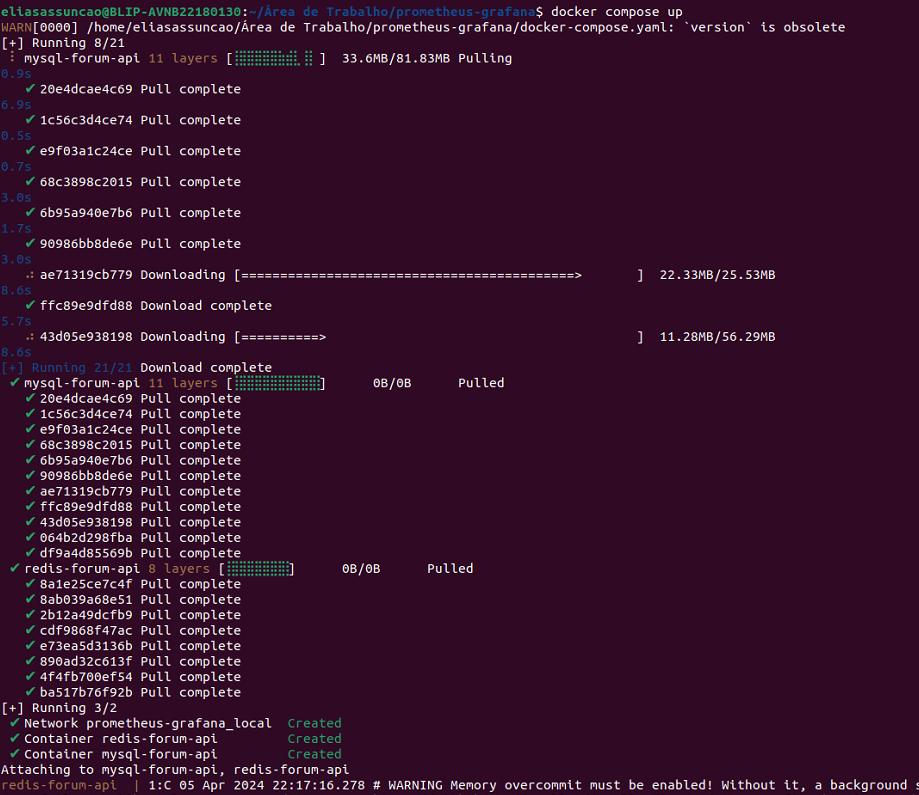
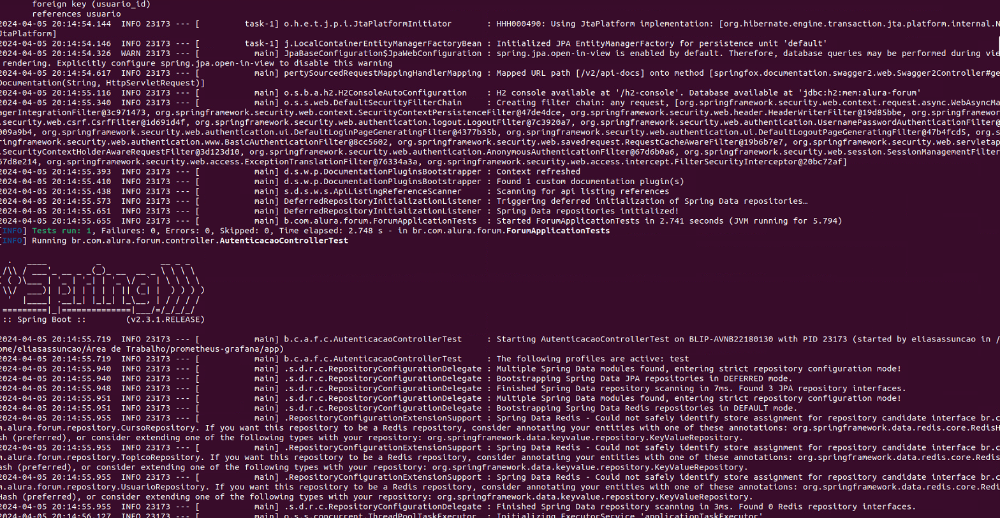
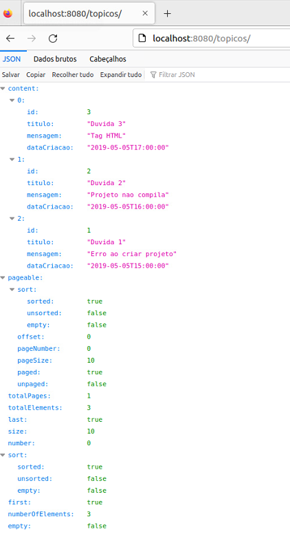
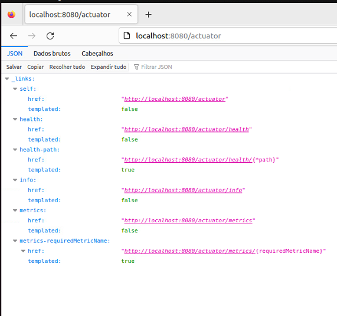
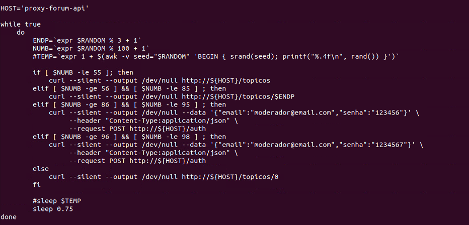
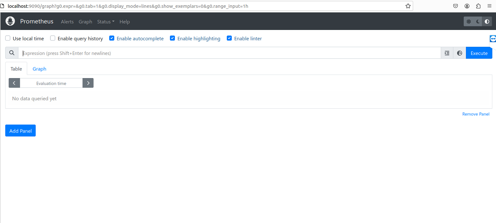
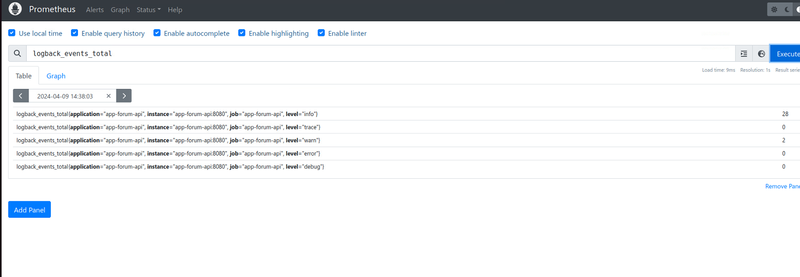
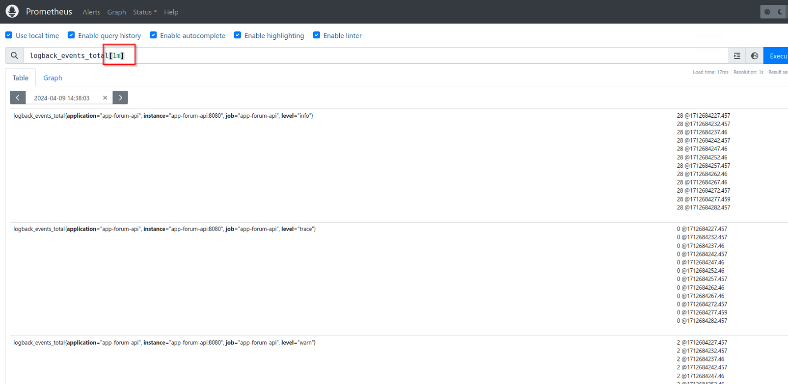
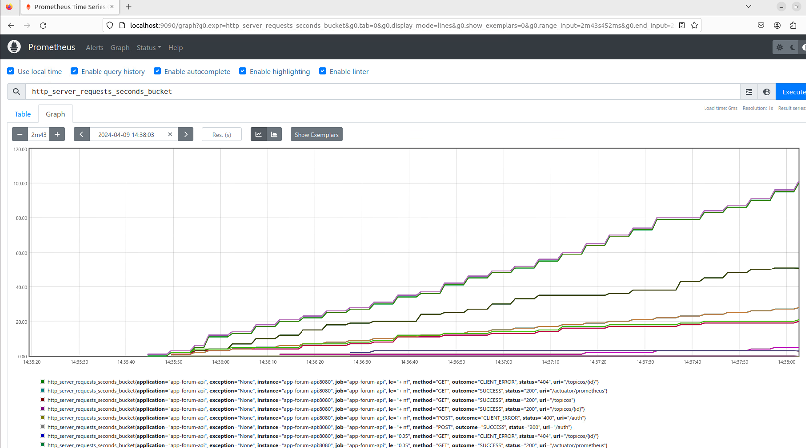

# DOCKER COMPOSE "Hospedando um site com banco de dados Mongodb"


**Objetivo**:

O projeto de observabilidade com Prometheus visa oferecer uma solução abrangente para monitorar e analisar o desempenho de uma aplicação Java em tempo real. Com uma abordagem proativa, o sistema permite identificar, diagnosticar e resolver potenciais problemas antes que impactem significativamente a experiência do usuário final.


## 📌 Requisitos

Ambiente de Desenvolvimento Integrado (IDE):
Para o desenvolvimento da aplicação Java e a gestão de suas dependências, é necessário o uso de uma IDE adequada. Recomenda-se o uso do Eclipse devido à sua integração nativa com o Maven, o que simplifica o processo de gerenciamento de dependências.

Docker e Docker-Compose:
O projeto faz uso das tecnologias Docker e Docker-Compose para facilitar a configuração e a implantação de ambientes de desenvolvimento e produção. Essas ferramentas fornecem uma maneira consistente e eficiente de empacotar, distribuir e executar a aplicação em diferentes ambientes.

Java JDK 1.8.0_312:
O ambiente de desenvolvimento requer o Java Development Kit (JDK) versão 1.8.0_312 ou superior. Esta versão específica do JDK foi selecionada devido à compatibilidade com as dependências e bibliotecas utilizadas no projeto.

Maven:
O Maven é uma ferramenta de automação de compilação amplamente utilizada no ecossistema Java. Ele é usado para gerenciar dependências, compilar o código-fonte, executar testes e criar artefatos de distribuição da aplicação. É fundamental que o Maven esteja instalado e configurado corretamente no ambiente de desenvolvimento.


## 📦 Documentação

**Actuator**

Ao adicionar o Spring Boot Actuator ao projeto, estamos habilitando uma série de funcionalidades poderosas para monitoramento e gerenciamento da aplicação. Abaixo está aprimorada a descrição do processo de adição e configuração do Actuator, juntamente com algumas explicações adicionais:

Dependência Maven:
O Spring Boot Actuator é adicionado como uma dependência no arquivo pom.xml do projeto Maven. Isso permite que o Maven gerencie automaticamente as dependências necessárias para o projeto. Aqui está a configuração da dependência:

```
<dependencies>
    <dependency>
        <groupId>org.springframework.boot</groupId>
        <artifactId>spring-boot-starter-actuator</artifactId>
    </dependency>
</dependencies>
```

Certifique-se de incluir esta configuração dentro da seção <dependencies> do seu arquivo pom.xml.

Configuração do Actuator:
O arquivo application.properties (ou application.yml) é usado para configurar o comportamento do Spring Boot Actuator. Aqui, estabelecemos quais endpoints devem ser expostos e quais detalhes devem ser exibidos. Por exemplo:

```
# Configuração do Actuator
management.endpoint.health.show-details=always
management.endpoints.web.exposure.include=health,info,metrics
```

*management.endpoint.health.show-details=always:* Define que os detalhes completos do endpoint de saúde (/actuator/health) devem ser mostrados sempre que consultados.
*management.endpoints.web.exposure.include=health,info,metrics:* Especifica quais endpoints do Actuator devem ser expostos. Neste caso, estamos expondo os endpoints de saúde, 
informações e métricas, que são essenciais para monitoramento e gerenciamento da aplicação.

*Considerações sobre Endpoints:*
Os endpoints health, info e metrics fornecem informações cruciais sobre o estado da aplicação, informações adicionais sobre a aplicação e métricas de desempenho, respectivamente. É importante ressaltar que esses endpoints são destinados ao uso interno e não devem ser expostos publicamente. Em um ambiente de produção, é fundamental proteger esses endpoints de acesso não autorizado.

**Subindo nossos containers com o docker compose**

Apos configurar as dependencias, podemos subir nossos containers para isso vamos utilizar o comando:

```
docker compose up -d

```



**Compilamos a aplicação**

Também bildamos a aplicação usando o maven, Não vamos entrar em detalhes pois não e o foco do projeto.




**Nossa aplicação funcionando corretamente**

Podemos verificar que nossa aplicação subiu corretamente e esta funcionando ao acessar localhost:8080/topicos




Também podemos verificar que o actuator esta funcionando, basta acessar localhost:8080/actuator




**Simulação de Consumo de API para Métricas no Prometheus**

Para enriquecer as métricas coletadas pelo Prometheus e garantir uma visão abrangente do desempenho da aplicação, será implementado um container cliente que simulará o consumo da API. Este container executará um script que realizará requisições à API, tanto corretas quanto com erros, com o objetivo de gerar métricas relevantes para monitoramento.




**Prometheus**

Apos alimentar nossa API, podemos acessar o Prometheus no localhost:9090



**PAnatomia e Tipos de Dados das Métricas no Prometheus**

***Anatomia das Métricas:***

*Nome da Métrica (Metric Name):* É o identificador único da métrica e descreve a informação sendo coletada. Exemplo: http_requests_total, que representa o número total de requisições HTTP.

*Rótulos (Labels):* Os rótulos são pares chave-valor que identificam diferentes séries temporais dentro de uma métrica. Eles permitem a segmentação e filtragem dos dados. Exemplo: {method="GET", status="200"}.

*Amostra (Sample):* É o valor numérico da métrica em um ponto específico no tempo. Ele é representado pelo valor da métrica na série temporal identificada pelos rótulos. Exemplo: 123.

***Tipos de Dados das Métricas:***

*Vetor Instantâneo (Instant Vector):* Representa um único valor para cada série temporal no momento da consulta. Por exemplo, ao consultar a métrica http_requests_total, um vetor instantâneo poderia retornar o número total de requisições HTTP no momento da consulta para cada conjunto único de rótulos.

*Vetor de Intervalo (Range Vector):* Representa um conjunto de valores para cada série temporal em um intervalo de tempo específico. Por exemplo, ao consultar a métrica http_requests_total ao longo de um período de 5 minutos, um vetor de intervalo poderia retornar o número total de requisições HTTP para cada conjunto único de rótulos durante esse intervalo de tempo.

*Float (Ponto Flutuante):*Representa valores numéricos de ponto flutuante, como contadores ou tempos de resposta. São usados para quantidades que podem variar continuamente. Exemplo: 3.14.

*String (Texto):* Representa valores de texto. Geralmente, não são utilizados para métricas numéricas, mas podem ser usados para rotular ou identificar séries temporais. Por exemplo, um rótulo de status HTTP como "200 OK".

**🔥 Conclusão 🔥**

Após completarmos todas as configurações necessárias, o Prometheus está agora monitorando nossa aplicação. Isso nos permite acessar diversas métricas importantes para avaliar o desempenho e a saúde do nosso sistema. Por exemplo:






**Vamos utilizar esse projeto como base para implementar o Grafana**

⌨️ com ❤️ por [Elias Assunção](https://github.com/Hooligam) 🔥

